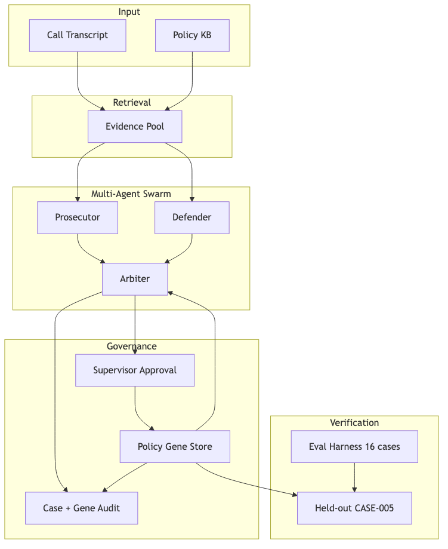

# ConductGene Swarm

[](https://github.com/FUYOH666/conductgene-swarm/actions/workflows/ci.yml)
[](https://github.com/FUYOH666/conductgene-swarm/actions/workflows/docker-smoke.yml)
[](https://www.python.org/downloads/)
[](LICENSE)
[](https://github.com/FUYOH666/conductgene-swarm/releases)

**Human-approved AI conduct QA that remembers supervisor corrections safely.**

Multi-agent conduct QA for regulated industries. Prosecutor, Defender, and Arbiter agents review call transcripts with evidence-grounded citations. When a supervisor corrects the verdict, the system stores a **supervisor-approved Policy Gene** — auditable, rollbackable institutional memory.

Built for [UCWS Singapore 2026](https://luma.com/UCWS2026) — **AGENT** track (dual submission with [AttestRWA](https://github.com/FUYOH666/attestrwa) on **APPLICATION** track). See [UCWS dual-track guide](docs/UCWS_DUAL_TRACK.md).

<p align="center">
  <a href="docs/assets/architecture.png">
    
  </a>
</p>

## Problem → Solution

| Problem | Solution |
|---------|----------|
| QA teams repeat the same corrections | Policy Genes preserve approved patterns |
| LLMs hallucinate policy | Evidence-grounded citations + abstain |
| Regulators need accountability | Supervisor approval, audit trail, rollback |

## Eval metrics (mock mode, synthetic suite)

| Metric | Value |
|--------|-------|
| Scenario pass rate | 16/16 (100%) |
| Citation coverage | 100% |
| Abstain rate | ~6.3% (CASE-007) |
| Gene learning (CASE-002 → CASE-005) | `escalation_offered`: needs_review → pass |

Run `./scripts/verify_all.sh` or `./scripts/qa_matrix.sh` to reproduce locally.

**Live stack (v0.5 — BGE + Qdrant + LLM providers):**

```bash
cp .env.example .env   # add CONDUCTGENE_OPENROUTER_API_KEY for cloud LLM
uv sync --extra dev --extra retrieval --extra live --extra ui

# Start Qdrant + Services-BGE (embedding :9001, reranker :9002)
docker run -d --name qdrant -p 6333:6333 qdrant/qdrant
uv run python scripts/discover_services.py
uv run python scripts/synth_data.py          # optional: extend KB
uv run python scripts/ingest_qdrant.py --rebuild

# Live retrieval + mock agents (CI-safe default)
CONDUCTGENE_RETRIEVAL_MODE=qdrant_rerank CONDUCTGENE_ENABLE_RERANKER=true uv run conductgene-ui

# Full live LLM swarm (OpenRouter / LM Studio / instruct gateway)
CONDUCTGENE_MODE=live CONDUCTGENE_LLM_PROVIDER=openrouter uv run python scripts/run_live_simulation.py
uv run python scripts/bench_models.py --provider openrouter --limit 4
```

**Docker live profile** (Qdrant in compose; BGE/LM Studio on host):

```bash
docker compose -f docker-compose.yml -f docker-compose.live.yml up --build
```

**Singapore pre-flight:**

```bash
./scripts/run_simulation_matrix.sh          # full scorecard → reports/simulation_matrix.md
SKIP_LIVE=true ./scripts/run_simulation_matrix.sh   # offline only (CI gate)
```

Primary booth demo: [docs/singapore-demo-runbook.md](docs/singapore-demo-runbook.md) (LM Studio + qdrant_rerank).

See [docs/ROADMAP.md](docs/ROADMAP.md) · [docs/qdrant-retrieval.md](docs/qdrant-retrieval.md) · [docs/live-simulation.md](docs/live-simulation.md)

## Quick start

```bash
git clone https://github.com/FUYOH666/conductgene-swarm.git
cd conductgene-swarm
cp .env.example .env
uv sync --extra dev --extra ui
./scripts/verify_all.sh    # full virtual verification
./scripts/demo.sh          # 90-second demo path
uv run conductgene-ui     # 5-panel Streamlit demo
```

**Docker:**

```bash
docker compose up --build
```

## Demo video

**Local recording:** [`docs/submission/conductgene-demo.webm`](docs/submission/conductgene-demo.webm) (auto-generated, ~90s)

**YouTube (portal Demo URL):** [youtu.be/5wIBi-HkK9Y](https://youtu.be/5wIBi-HkK9Y)

Regenerate assets:

```bash
./scripts/capture_submission_assets.sh --with-video
```

Upload guide: [docs/submission/youtube-upload.md](docs/submission/youtube-upload.md) · Portal copy: [docs/submission/portal-copy.md](docs/submission/portal-copy.md)

AttestRWA demo (APPLICATION track, same portal entry): [youtube.com/shorts/BipB2qPzZz0](https://youtube.com/shorts/BipB2qPzZz0)

## API

```bash
uv run conductgene-serve   # http://127.0.0.1:8090/docs
```

| Endpoint | Description |
|----------|-------------|
| `GET /healthz` | Liveness |
| `GET /healthz/services` | BGE / Qdrant / LLM service probes |
| `GET /readyz` | Readiness |
| `POST /swarm/analyze` | Swarm review + audit record |
| `POST /genes/learn` | Store supervisor-approved Policy Gene |
| `GET /genes` | List genes |
| `POST /genes/{id}/rollback` | Deactivate gene (rollback) |
| `POST /eval/run` | Run synthetic scenario suite |
| `GET /audit/{case_id}` | Case provenance |
| `GET /audit/export` | Export case + gene audit trails |
| `GET /metrics/evolution` | Learning + quality metrics (cached eval) |

## CLI

```bash
uv run conductgene demo
uv run conductgene eval --suite all
uv run conductgene analyze --file data/scenarios/collections/case_002.json
uv run conductgene audit export --out reports/audit_export.json
```

## Docs

- [Product spec](docs/product-spec.md)
- [90-second demo script](docs/demo-script.md)
- [Demo video guide](docs/demo-video-guide.md)
- [Pitch deck](docs/pitch-deck.md)
- [UCWS dual-track guide](docs/UCWS_DUAL_TRACK.md)
- [Roadmap](docs/ROADMAP.md)
- [Qdrant retrieval setup](docs/qdrant-retrieval.md)
- [Live simulation guide](docs/live-simulation.md)
- [UCWS registration](docs/UCWS_REGISTRATION.md)
- [Submission checklist](docs/SUBMISSION.md)
- [Portal copy-paste (AGENT + APPLICATION)](docs/submission/portal-copy.md)
- [Resubmit checklist](docs/submission/resubmit-checklist.md)
- [Governance (IMDA MGF)](docs/governance.md)
- [Architecture](docs/architecture.md)
- [Contributing](CONTRIBUTING.md) · [Security](SECURITY.md) · [Releases](https://github.com/FUYOH666/conductgene-swarm/releases)

## License

MIT — see [LICENSE](LICENSE).
