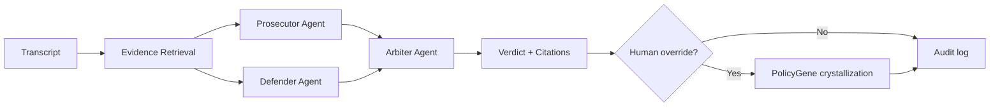

# Idea A: ConductGene Swarm

**Track:** AGENT (UCWS Singapore 2026)  
**Domain:** SEA regulated industries — fintech, collections, insurance conduct QA  
**Status:** Selected for implementation

---

## One-liner

Multi-agent conduct QA where successful review patterns **crystallize into auditable Policy Genes** — agents collaborate, humans override, the swarm learns with provenance and rollback.

---

## Problem

Regulated industries in Singapore and SEA deploy AI for call/chat QA, but:

1. **Static rule engines** miss nuance; pure LLM QA hallucinates citations
2. **Human overrides** are lost — supervisors repeat the same corrections
3. **Regulators** (IMDA MGF v1.5) require scoped agency, audit trails, human accountability

No product combines **evidence-grounded multi-agent review** with **auditable self-evolution**.

---

## Non-linear twist

Not "three agents chat about a transcript."

**Policy Genes** — inspired by [Evolver GEP](https://github.com/EvoMap/evolver) and [GenericAgent skill crystallization](https://github.com/lsdefine/GenericAgent):

| Concept | Meaning |
|---------|---------|
| **Gene** | A reusable conduct rule extracted from a successful review or human correction |
| **Provenance** | Which request, which agent roles, which evidence chunks produced the gene |
| **Eval score** | Before/after accuracy on synthetic held-out cases |
| **Rollback** | Any gene can be deactivated; audit log preserved |

When a supervisor corrects the Arbiter's verdict → system crystallizes **Gene #N** → next similar case applies the gene automatically → metrics show improvement.

---

## Agent collaboration model

| Agent | Role | Output |
|-------|------|--------|
| **Prosecutor** | Find potential violations | Checklist items `fail` with cited evidence |
| **Defender** | Find mitigating context | Checklist items `pass` / `needs_review` with citations |
| **Arbiter** | Synthesize final verdict | Unified checklist + supervisor summary + coaching tips |

All agents share the same **evidence pool** (ConductLens RAG pattern) — no agent invents policy text.

---

## Reuse from portfolio

| Asset | Source | Usage |
|-------|--------|-------|
| RAG + abstain + citations | SCB_hackaton ConductLens | Core pipeline |
| Synthetic conduct KB | `data/synthetic/kb/` | Demo dataset |
| Attestation concept | attestrwa | Gene provenance / future on-chain commit |
| Evolution log pattern | Plague-InGG | `evolution/genes.jsonl` |
| Remote AI mesh | cursor-skills-config | LLM / BGE / rerank via env |

---

## Demo hook (3 minutes)

1. Upload call transcript with threatening language
2. Swarm runs: Prosecutor flags violation → Defender notes script compliance attempt → Arbiter synthesizes with citations
3. Supervisor corrects: "Escalation offer was implicit, downgrade to needs_review"
4. **Gene #47 crystallized** — show before/after on second similar transcript
5. Governance panel: scoped agents, abstain on low evidence, full audit trail

---

## IMDA MGF v1.5 alignment

| MGF principle | ConductGene implementation |
|---------------|---------------------------|
| Human accountability | Human override required for gene activation |
| Transparency | Every verdict cites chunk_ids; genes show provenance |
| Risk bounding | Agents read-only on evidence; no shell/tools in MVP |
| Abstain | Low rerank score → explicit abstain, human review |

See [docs/governance.md](../governance.md).

---

## 48h MVP scope

- [x] Three-agent swarm (mock + optional LLM)
- [x] In-memory evidence retrieval (synthetic KB)
- [x] PolicyGene store + learn endpoint
- [x] FastAPI `/healthz`, `/swarm/analyze`, `/genes/learn`
- [x] CLI demo script
- [x] pytest: happy path, abstain, evolution

## Post–June 3 polish

- Live BGE + Qdrant integration
- Streamlit UI
- A2A Agent Card
- Demo video + pitch deck
- Optional EAS attestation for gene commits (attestrwa bridge)

---

## Market moat

- **Governance + evolution proof** — rare combination in 2026 hackathon field
- **SEA-native narrative** — IMDA, MAS conduct, collections QA
- **Portfolio depth** — not a weekend wrapper; built on shipped ConductLens + AttestRWA patterns

---

## Scoring (plan matrix)

| Criterion | Score |
|-----------|-------|
| Demo impact 48h | ★★★★ |
| Uniqueness | ★★★★★ |
| Your expertise | ★★★★ |
| SEA relevance | ★★★★★ |
| OSS clarity | ★★★★ |

**Recommendation:** Primary build target for UCWS Demo Day Singapore.
