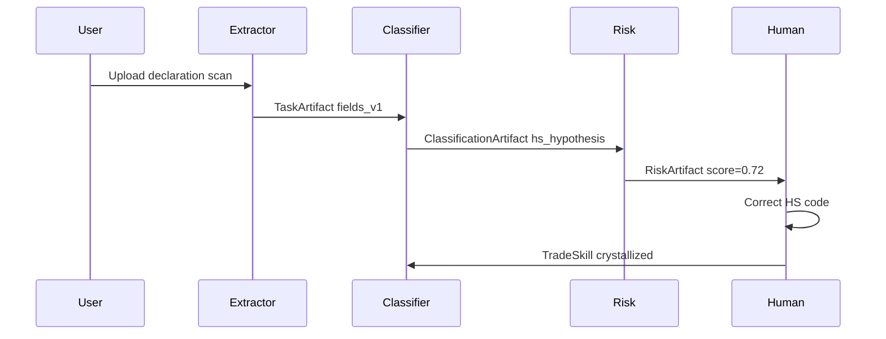

# Idea B: TradePath Collective

**Track:** AGENT (UCWS Singapore 2026)  
**Domain:** Customs / trade compliance / logistics intelligence  
**Status:** Spec only — strongest long-term $1M bet

---

## One-liner

A **collective of specialist customs agents** that collaborate via task contracts, share federated memory, and **learn from analyst corrections** — turning senior expertise into portable skills across tenants.

---

## Problem

Cross-border trade (Singapore hub ↔ EAEU, ASEAN, global):

- Declaration prep takes **hours** per shipment
- Errors trigger **fines, delays, seized goods**
- Knowledge trapped in **senior analysts' heads** — juniors repeat mistakes
- Generic OCR/classifiers ignore **domain nuance** (TN VED, valuation, origin rules)

---

## Non-linear twist

Not "OCR + HS classifier in a pipeline."

**TradePath Collective** — agents as **peers with contracts**, not a linear DAG:

| Agent | Specialty | Hands off |
|-------|-----------|-----------|
| **Extractor** | Messy scan → structured fields | Normalized doc artifact |
| **HS-Classifier** | TN VED / HS code hypothesis + confidence | Classification artifact + evidence |
| **Risk-Scorer** | Valuation/origin/red-flag patterns | Risk score + rationale |
| **Escalation-Router** | Route to human vs auto-approve | Task status + SLA |
| **Human Analyst** | First-class agent with **veto** | Corrections → skill extraction |

**Federated memory:** agents share a **tenant-scoped knowledge graph**; successful corrections crystallize into **TradeSkills** transferable with privacy (differential patterns, not raw customer data).

---

## Collaboration protocol (A2A-inspired)

Each handoff is a **typed artifact** with provenance — auditable, replayable, evaluable.

---

## Reuse from portfolio

| Asset | Source | Usage |
|-------|--------|-------|
| Hybrid retrieval | DT-xml (private) | Similar declaration search |
| TN VED RAG | TN-ved-AI (private) | HS classifier agent |
| Excel normalization | excel-customs-eaeu | Extractor patterns |
| BGE + Qdrant stack | Services-BGE + DT-xml | Vector search |
| Attestation | attestrwa | Audit trail for classification decisions |

---

## Singapore angle for Demo Day

Singapore as **global trade hub**:

- Demo corridor: **SG re-export ↔ EAEU declaration similarity**
- Narrative: "Analyst in Singapore corrects once → skill helps team in Bangkok"
- Partners: freight forwarders, customs brokers, trade compliance SaaS

---

## Demo hook (3 minutes)

1. Upload messy declaration scan (synthetic)
2. Four agents collaborate — live artifact handoff visualization
3. Show 3 similar historical declarations (DT-xml hybrid search)
4. Analyst corrects HS code → **TradeSkill extracted**
5. Re-run similar case — classifier applies skill, latency drops

---

## 48h MVP feasibility

| Factor | Assessment |
|--------|------------|
| Synthetic data prep | **Heavy** — needs declaration corpus |
| DT-xml extract | Private — patterns only |
| Demo impact | ★★★ — impressive but slower to polish |
| Your expertise | ★★★★★ — #1 million-dollar bet |

**Verdict:** Best for **post-hackathon product line** or Phase 2 if ConductGene wins Demo Day slot and team expands.

---

## Scoring (plan matrix)

| Criterion | Score |
|-----------|-------|
| Demo impact 48h | ★★★ |
| Uniqueness | ★★★★ |
| Your expertise | ★★★★★ |
| SEA relevance | ★★★★ |
| OSS clarity | ★★★ |

---

## Path forward

1. Keep as documented alternative in UCWS submission narrative
2. Reuse ConductGene's PolicyGene engine → rename to TradeSkill
3. Port DT-xml synthetic examples when ready for public OSS
4. Target customs GTM from [customs-logistics-gtm.md](https://github.com/FUYOH666/positioning-hub) strategy
