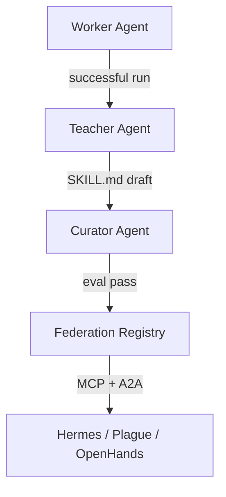

# Idea C: Skill Federation Protocol (SFP)

**Track:** AGENT (UCWS Singapore 2026)  
**Domain:** Agent infrastructure — learning + collaboration as the product  
**Status:** Spec only — Plan B for pure AGENT track play

---

## One-liner

A meta-layer where agents **teach other agents** via portable `SKILL.md` + MCP stubs — successful runs auto-crystallize skills, publish to a **federation registry** with eval scores, and any runtime (Hermes, Plague, OpenHands) can **hire** a skill via A2A.

---

## Problem

Every agent framework reinvents tools:

- Skills don't survive **runtime changes** (Hermes → Cursor → OpenHands)
- No **proof of learning** — "the agent got better" is anecdotal
- No **cross-team collaboration** — agents can't share validated capabilities
- MCP servers proliferate without **evaluated, versioned skill contracts**

---

## Non-linear twist

Not a skill marketplace UI.

**Skill Federation Protocol** — three collaborating meta-agents:

| Agent | Role |
|-------|------|
| **Teacher** | Observes Worker agent run → extracts reusable skill pattern |
| **Curator** | Validates skill against eval harness → assigns score |
| **Federation** | Publishes skill to registry; serves via MCP + A2A Agent Card |

**Measurable claim:** Agent B uses federated skill → **40% token savings**, **2x success rate** on benchmark — not vibes.

---

## Standards alignment

| Standard | SFP usage |
|----------|-----------|
| [SEP-2640 Skills over MCP](https://github.com/modelcontextprotocol/modelcontextprotocol/pull/2640) | Skill transport format |
| [A2A Protocol](https://github.com/a2aproject/A2A) | Cross-runtime skill hire |
| Agent Skills `SKILL.md` | Cursor/Hermes compatible |

---

## Reuse from portfolio

| Asset | Source | Usage |
|-------|--------|-------|
| Evolution log | Plague-InGG | Run → skill extraction trigger |
| Skills sync | cursor-skills-config | SKILL.md layout, sync.sh pattern |
| Hermes skills | hermes-agent fork | Consumer runtime #1 |
| MCP server | Cleaner-OS | Reference MCP implementation |
| GenericAgent pattern | External | Crystallization algorithm inspiration |

---

## Demo hook (3 minutes)

1. Agent A (Plague-style) solves dev cleanup task — success logged
2. Teacher extracts `syscleaner-audit` skill → Curator runs 5-case eval
3. Federation publishes skill v1.0 (score: 0.92)
4. Agent B (different runtime, mock Hermes) **hires** skill via A2A
5. Side-by-side: with skill vs without — token count + success rate

---

## 48h MVP feasibility

| Factor | Assessment |
|--------|------------|
| Scope | **Wide** — meta-layer needs 2 runtimes or good mocks |
| Demo clarity | ★★★★ — very compelling if metrics work |
| SEA relevance | ★★★ — infra play, less localized |
| OSS clarity | ★★★★★ — pure open protocol |

**Verdict:** Excellent **Plan B** or **hybrid with ConductGene** — export PolicyGenes as federated skills post-MVP.

---

## Hybrid path (ConductGene + SFP)

ConductGene Swarm (selected) can evolve into SFP:

1. PolicyGene = domain-specific skill
2. Gene export → `SKILL.md` + MCP tool stub
3. Federation registry = gene catalog with eval scores
4. Demo Day narrative: "We built governed conduct QA **and** a skill export protocol"

---

## Scoring (plan matrix)

| Criterion | Score |
|-----------|-------|
| Demo impact 48h | ★★★★ |
| Uniqueness | ★★★★★ |
| Your expertise | ★★★★★ |
| SEA relevance | ★★★ |
| OSS clarity | ★★★★★ |

---

## External references

- [GenericAgent](https://github.com/lsdefine/GenericAgent) — skill crystallization
- [modelcontextprotocol/servers](https://github.com/modelcontextprotocol/servers) — MCP patterns
- [MemOS](https://github.com/MemTensor/MemOS) — layered memory for skill context
